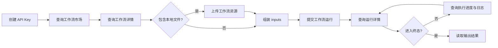

# 工作流 API 接入指南

工作流 API 面向希望把晨羽智云已发布 ComfyUI 工作流接入自己产品的开发者。一次完整调用不是只请求“提交运行”接口，而是先读取工作流当前版本及参数清单，按清单准备输入，再提交任务并查询执行结果。

## 完整调用链



## 1. 准备认证信息

在控制台创建 API Key。后续所有请求都携带同一个 Bearer Token：

```http
Authorization: Bearer your_api_key
```

API 基础地址为 `https://www.chenyu.cn/api/open/v2`。不要把 API Key 放入浏览器前端或公开仓库，建议由自己的服务端调用。

## 2. 发现可调用的工作流

调用 [查询工作流市场列表](/api-reference/workflow/market-list)：

```http
GET /api/open/v2/workflow/market/list?page=1&page_size=20&sort=latest
```

从响应中取得 `workflow_id`。可以通过 `keyword`、`tag` 筛选工作流；列表中的报价和版本信息用于展示，真正提交前仍应查询详情。

## 3. 获取版本和输入规则

调用 [查询工作流详情](/api-reference/workflow/market-info)：

```http
GET /api/open/v2/workflow/market/info?workflow_id=wf_xxx
```

重点读取三个字段：

- `revision_id`：当前发布版本。提交时传入可避免准备参数期间版本发生变化
- `editable_parameter_manifest`：允许提交的输入参数、JSON 类型、必填项、下拉选项和文件类型
- `candidate_output_manifest`：预期输出的名称及图片、视频、音频类型

`inputs` 的 key 必须使用 `editable_parameter_manifest[].name`。详细填写规则、下拉列表和资源 ID 传法见 [工作流详情参数说明](/api-reference/workflow/market-info)。

## 4. 上传本地资源（按需）

如果 manifest 包含图片、视频、音频或文件类型，并且素材位于本地，先调用 [上传工作流资源](/api-reference/workflow/assets-upload)：

```bash
curl -X POST "https://www.chenyu.cn/api/open/v2/assets" \
  -H "Authorization: Bearer your_api_key" \
  -F "file=@input.png" \
  -F "media_type=image" \
  -F "purpose=temp_input"
```

上传成功后取得 `asset_uri`，例如 `asset://asset_xxx`。把这个完整字符串作为对应 `inputs` 参数值；不要只传裸 `asset_id`。

## 5. 提交工作流运行

调用 [提交工作流运行](/api-reference/workflow/run-submit)。以下参数来自前面的详情和上传接口：

```json
{
  "workflow_id": "wf_xxx",
  "revision_id": "wfr_xxx",
  "idempotency_key": "order_20260728_0001",
  "inputs": {
    "n6_text": "一只橘猫坐在窗边",
    "n4_sampler_name": "euler",
    "n3_seed": 156680208700286,
    "n10_image": "asset://asset_xxx"
  }
}
```

每次业务调用使用稳定且唯一的 `idempotency_key`。网络超时后可以使用同一个幂等键重试，避免重复创建任务和重复预扣费。成功后保存响应中的 `run_order_id`。

如果详情返回 `may_incur_external_model_cost=true`，阅读 `external_cost_notice`，并在确认接受风险后传 `accept_external_cost_risk=true`。

## 6. 查询进度和结果

使用 `run_order_id` 调用 [查询工作流运行详情](/api-reference/workflow/run-info)，获得任务状态、费用和终态结果：

```http
GET /api/open/v2/workflow/run/info?run_order_id=wfrun_xxx
```

任务执行期间，可调用 [查询工作流执行详情](/api-reference/workflow/run-execution) 获取更细的进度、队列位置和日志：

```http
GET /api/open/v2/workflow/run/execution?run_order_id=wfrun_xxx
```

建议每 2～5 秒轮询一次，并使用退避策略控制请求频率。`run_status` 进入 `succeeded`、`failed` 或 `cancelled` 后停止轮询。成功时结合详情接口的 `candidate_output_manifest` 读取输出，不要仅通过文件扩展名猜测结果类型。

## 接入检查清单

- 提交前重新查询详情并锁定 `revision_id`
- 只提交 manifest 声明的参数，严格保留数字、布尔值和下拉选项的 JSON 类型
- 本地文件先上传，并传完整 `asset_uri`
- 幂等键按一次业务调用生成，重试时保持不变
- 保存 `run_order_id`，合理轮询并处理所有终态
- 向最终用户展示实际结算结果，而不是只展示提交时的预估报价
